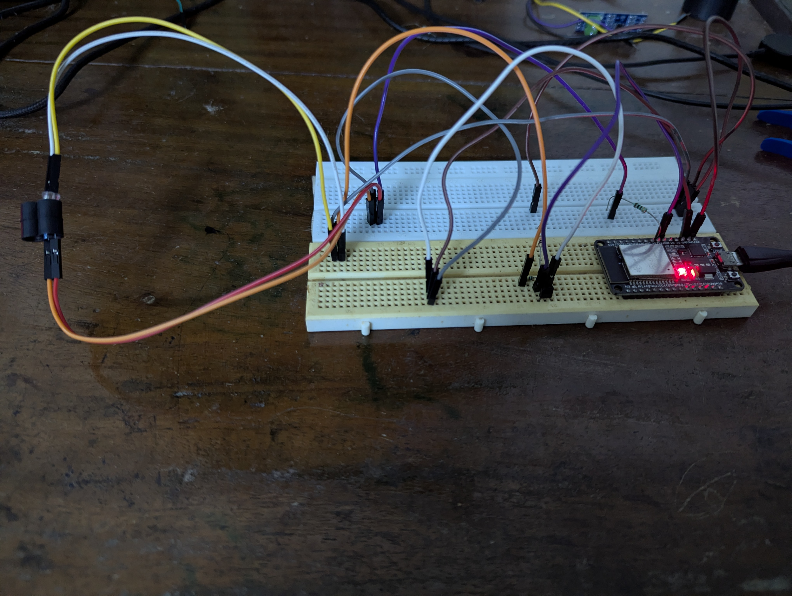

**Optical IR UART Communication – ESP32 Energy Meter Probe**

A compact, open-source infrared communication system using ESP32.
Designed to read optical ports on electronic energy meters (IEC 62056-21 style) and also useful for general IR-UART experiments.

Supports two hardware versions:

v2 – LM393 + Transistor Amplified (Recommended)

v1 – Minimal Components (Legacy)

**🔥 v2 – LM393 Amplified Probe (Recommended)**

The new version offers:

- Up to 2400 baud stable IR UART

- Clean digital output using LM393 comparator

- Dual-transistor design
(BC547 amplifier for photodiode + BC548 driver for IR LED)

- Strong IR transmission

- Noise-resistant reception suitable for real energy meters

- Compatible with L&T / Secure / Genus / Landis+Gyr optical ports

- Works reliably even in daylight

- Plug-and-play with ESP32 HardwareSerial

**📘 v1 – Minimal Photodiode Probe (Legacy)**

This is the original simple design using only:

- 1× Photodiode

- 1× IR LED

- 1× BC547 transistor

- A few resistors

- Works at 300 baud and designed for people who have very limited components.

**🧰 Hardware Requirements**

- ESP32 Dev Board

- IR LED (transmitter)

- Photodiode (receiver)

- LM393 comparator (single module or chip)

- BC547 (receiver amplifier transistor)

- BC548 / 2N2222 (IR LED driver transistor)

**Resistors:**

- 56k–100k (photodiode → BC547 base)

- 10k (BC547 collector pull-up)

- 22k + 10k (LM393 threshold divider)

- 4.7k (LM393 output pull-up)

- 100 Ω (IR LED current limit)

- Optional: 3D printed optical probe housing