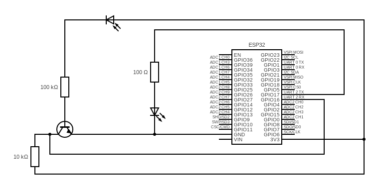

**Circuit Image**

**ESP32 IR UART Communication**

A simple infrared communication system using an ESP32, a BC547 transistor amplifier, an IR LED transmitter, and a photodiode receiver.
This project demonstrates how to send and receive UART data over infrared light, enabling optical serial communication similar to energy meter optical probes (IEC 62056-21 style).

**Features**

Send and receive text data over IR

Uses 300 baud UART pulses

Works with basic components (BC547 + photodiode + IR LED)

Demonstrates IR modulation and optical UART

Clean decoding using ESP32 HardwareSerial

Fully open-source and easy to build

**Hardware Used**

ESP32 Dev Board

IR LED (transmitter)

Photodiode (receiver)

BC547 NPN transistor

Resistors

100k (photodiode → base)

4.7k–10k (pull-up on collector)

100Ω (IR LED current limit)
